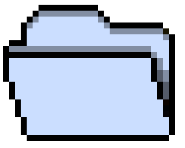
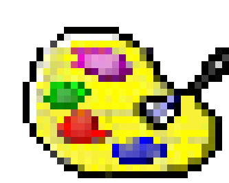
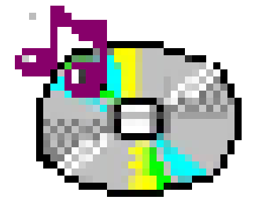
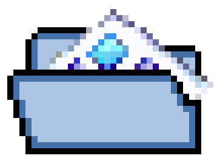
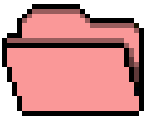
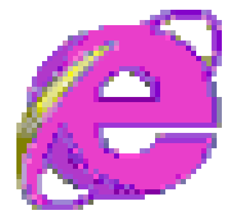
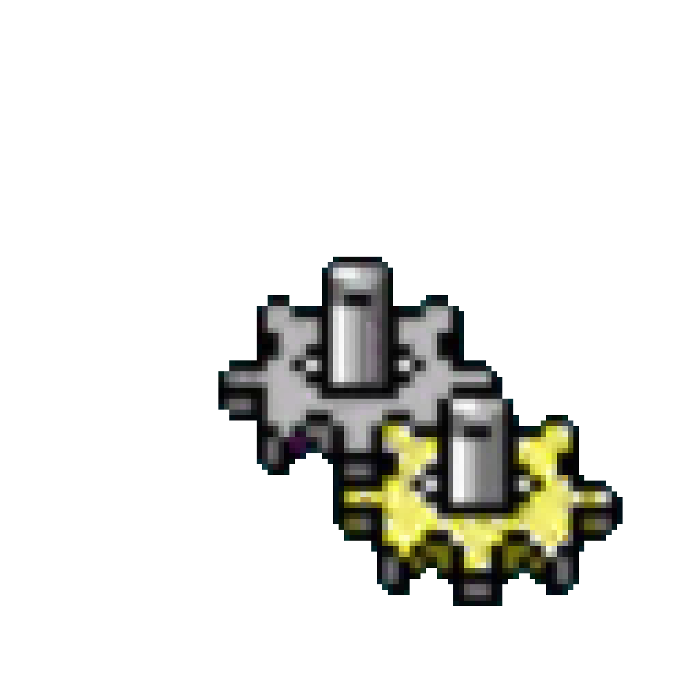
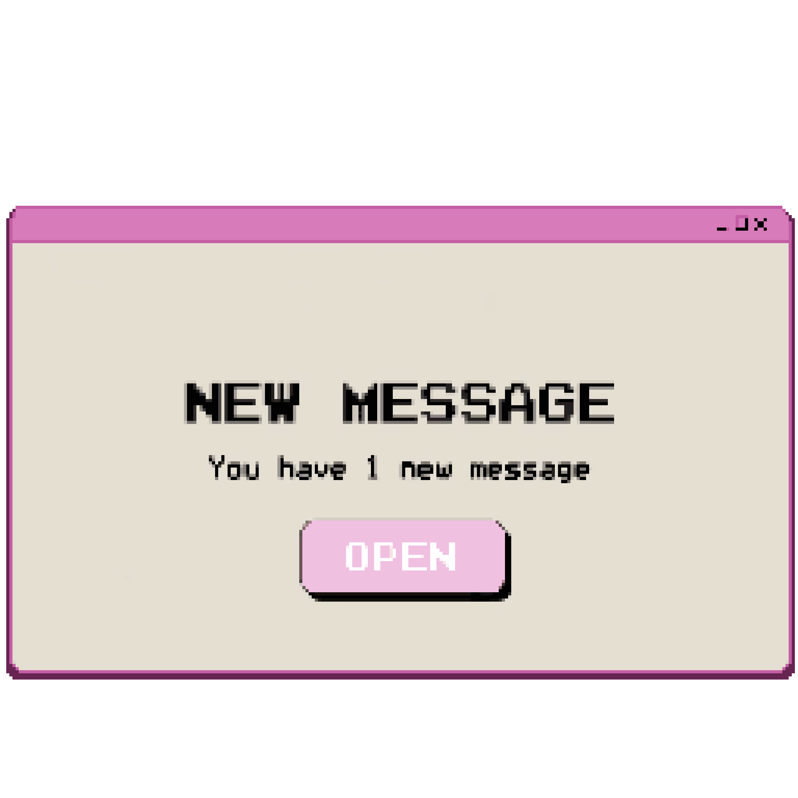
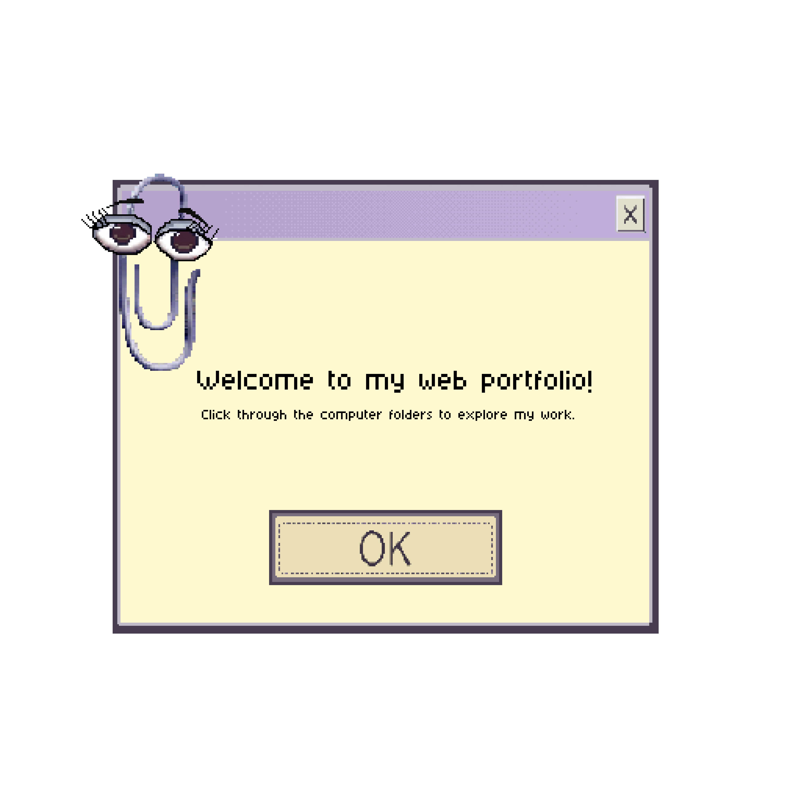
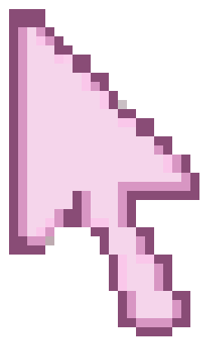

```{=html}
<style>
  body:has(.alt-home-desktop) #quarto-header,
  body:has(.alt-home-desktop) #quarto-footer,
  body:has(.alt-home-desktop) .nav-footer,
  body:has(.alt-home-desktop) #title-block-header { display: none !important; }
  body:has(.alt-home-desktop) { margin: 0; overflow: hidden; }

  .alt-home-desktop { background-color: #201169; background-image: linear-gradient(115deg, rgba(6,3,37,.24), transparent 30%, transparent 70%, rgba(61,0,111,.22)), url("images/ux-dashboard/hyperpunk-hill-simulation.png"); background-position: center, center; background-repeat: no-repeat, no-repeat; background-size: cover, cover; color: #251928; height: 100vh; inset: 0; overflow: hidden; position: fixed; width: 100vw; z-index: 9999; }
  .alt-home-desktop::after { background: radial-gradient(ellipse at 50% 100%, rgba(255,23,187,.18), transparent 58%), linear-gradient(115deg, rgba(255,255,255,.08), transparent 24%, transparent 74%, rgba(28,0,90,.25)); content: ""; inset: 0; pointer-events: none; position: absolute; z-index: 0; }
  .alt-home-desktop, .alt-home-desktop * { cursor: none !important; }
  .alt-boot-sequence { background: #000; inset: 0; position: absolute; transition: opacity .42s ease-out; z-index: 7; }
  .alt-boot-sequence, .alt-boot-sequence * { cursor: default !important; }
  .alt-boot-sequence .alt-power-on { cursor: pointer !important; }
  .alt-boot-sequence.is-complete { opacity: 0; pointer-events: none; }
  .alt-boot-power { display: grid; inset: 0; place-items: center; position: absolute; }
  .alt-power-on { background: #c7c3c6; border: 2px outset #fff; box-shadow: 2px 2px 0 #555, -1px -1px 0 #e6e6e6; color: #111; font-family: "Courier New", monospace; font-size: clamp(12px, 1.1vw, 16px); font-weight: 700; letter-spacing: .04em; padding: 8px 17px; }
  .alt-power-on:active { border-style: inset; transform: translate(1px, 1px); }
  .alt-power-on:disabled { opacity: .7; }
  .alt-post-screen, .alt-diagnostic-screen, .alt-post-screen *, .alt-diagnostic-screen * { box-sizing: border-box; color: #efefef !important; font-family: "Courier New", Courier, monospace !important; font-weight: 700; text-shadow: .5px 0 0 rgba(255,255,255,.35); }
  .alt-post-screen, .alt-diagnostic-screen { inset: 0; position: absolute; }
  .alt-post-screen { font-size: clamp(13px, 1.35vw, 20px); line-height: 1.36; overflow: hidden; padding: clamp(18px, 2.5vw, 36px); }
  .alt-post-line { margin: 0; min-height: 1.36em; white-space: pre-wrap; }
  .alt-terminal-ellipsis { display: inline-block; min-width: 3ch; }
  .alt-diagnostic-screen { font-size: clamp(12px, 1.28vw, 19px); line-height: 1.32; overflow: hidden; padding: clamp(16px, 2vw, 28px); }
  .alt-diagnostic-panel { border: 6px double #e7e7e7; box-sizing: border-box; max-width: 950px; padding: 12px 22px 15px; width: min(76vw, 950px); }
  .alt-diagnostic-section { display: grid; gap: 2px; }
  .alt-diagnostic-section + .alt-diagnostic-section { border-top: 5px double #e7e7e7; margin: 9px -22px 0; padding: 10px 22px 0; }
  .alt-diagnostic-row { display: grid; grid-template-columns: minmax(210px, 35%) 1fr; }
  .alt-diagnostic-list { margin-top: clamp(48px, 8vh, 82px); max-width: 1100px; }
  .alt-diagnostic-list p { margin: 0; }
  .alt-diagnostic-list .alt-diagnostic-rule { border-top: 3px solid #efefef; margin: 13px 0 7px; max-width: 1100px; }
  .alt-diagnostic-device { display: grid; grid-template-columns: 6ch 8ch 9ch 1fr; }
  .alt-desktop-icons, .alt-layer { inset: 0; position: absolute; }
  .alt-desktop-icons { align-content: start; display: grid; gap: 16px 24px; grid-template-columns: repeat(2, clamp(50px, 6vw, 78px)); grid-template-rows: repeat(4, 70px); inset: auto; left: 3vw; position: absolute; top: 4vh; z-index: 1; }
  .alt-icon { align-items: center; color: #fff4ff; display: flex; flex-direction: column; font-family: monospace; font-size: clamp(6px, .65vw, 10px); font-weight: 900; gap: 3px; left: 3vw; line-height: 1.05; position: absolute; text-align: center; text-decoration: none !important; text-shadow: 1px 1px 0 #14043f, 0 0 6px rgba(100,246,255,.72); width: clamp(50px, 6vw, 78px); }
  .alt-icon img { image-rendering: pixelated; max-height: 40px; max-width: 46px; object-fit: contain; }
  .alt-icon span { text-decoration: none !important; }
  .alt-icon:hover img, .alt-icon:focus-visible img { animation: alt-bounce .42s steps(3, end) both; }
  .alt-icon { left: auto !important; position: relative; top: auto !important; }
  .alt-contact img { max-width: 58px; }
  .alt-window-layer { bottom: 46px; left: 0; pointer-events: none; position: absolute; right: 0; top: 0; z-index: 2; }
  .alt-portfolio-window { background: #d6d2ca; border: 2px solid #20151e; box-shadow: 4px 4px 0 rgba(30, 21, 29, .48), inset 1px 1px #fff, inset -1px -1px #706b70; display: grid; grid-template-rows: auto minmax(0, 1fr) auto; min-height: min(330px, 58vh); min-width: min(360px, 72vw); overflow: hidden; pointer-events: auto; position: absolute; resize: both; }
  .alt-portfolio-window.is-active { box-shadow: 5px 5px 0 rgba(30, 21, 29, .56), inset 1px 1px #fff, inset -1px -1px #706b70; }
  .alt-window-titlebar { align-items: center; background: linear-gradient(90deg, #a84b85, #6d3f72); color: #fff; cursor: move; display: flex; font-family: monospace; font-size: clamp(9px, .9vw, 13px); font-weight: 900; gap: 7px; justify-content: space-between; min-height: 28px; padding: 3px 4px 3px 8px; user-select: none; }
  .alt-window-title { overflow: hidden; text-overflow: ellipsis; white-space: nowrap; }
  .alt-window-controls { display: flex; flex: 0 0 auto; gap: 3px; }
  .alt-window-control { align-items: center; background: #d6d2ca; border: 1px outset #fff; color: #251928; display: grid; font-family: monospace; font-size: 14px; font-weight: 900; height: 20px; line-height: 1; padding: 0; place-items: center; width: 22px; }
  .alt-window-control:active { border-style: inset; }
  .alt-window-content { background: #fff; border: 2px inset #fff; min-height: 0; overflow: hidden; }
  .alt-window-content iframe { background: #fff; border: 0; display: block; height: 100%; width: 100%; }
  .alt-window-status { background: #d6d2ca; border-top: 1px solid #f8f8f0; color: #4a3448; font-family: monospace; font-size: clamp(7px, .7vw, 10px); font-weight: 700; overflow: hidden; padding: 3px 6px; text-overflow: ellipsis; white-space: nowrap; }
  .alt-taskbar { align-items: center; background: #d6d2ca; border-top: 3px solid #f8f8f0; bottom: 0; box-shadow: inset 0 2px #fff; display: flex; font-family: monospace; font-size: clamp(10px, 1.1vw, 15px); font-weight: 900; height: 38px; left: 0; padding: 0 8px; position: absolute; right: 0; z-index: 4; }
  .alt-start { background: #d8b8df; border: 2px outset #fff; margin-right: 10px; padding: 4px 10px; }
  .alt-task-label { border: 2px inset #fff; padding: 4px 10px; white-space: nowrap; }
  .alt-window-tasks { align-items: center; display: flex; gap: 5px; min-width: 0; overflow-x: auto; padding-left: 6px; }
  .alt-window-task { background: #c9c5bf; border: 2px outset #fff; color: #2d2330; cursor: none; font-family: monospace; font-size: clamp(8px, .75vw, 11px); font-weight: 900; max-width: min(150px, 22vw); overflow: hidden; padding: 4px 8px; text-overflow: ellipsis; white-space: nowrap; }
  .alt-window-task.is-active { background: #e5c6df; border-style: inset; }
  .alt-desktop-boot-loader { display: grid; inset: 0; place-items: center; pointer-events: none; position: absolute; z-index: 3; }
  .alt-hourglass { border-left: 2px solid #f1e8d0; border-right: 2px solid #f1e8d0; display: block; filter: drop-shadow(1px 1px 0 #36265b); height: 27px; position: relative; transform-origin: center; width: 20px; }
  .alt-hourglass::before, .alt-hourglass::after { border-left: 8px solid transparent; border-right: 8px solid transparent; content: ""; left: 0; position: absolute; }
  .alt-hourglass::before { border-top: 11px solid #f57ec7; top: 2px; }
  .alt-hourglass::after { border-bottom: 11px solid #7deeff; bottom: 2px; }
  .alt-hourglass { animation: alt-hourglass-turn 1.15s steps(2, end) infinite; }
  .alt-message, .alt-welcome, .alt-loading { align-items: center; display: grid; justify-items: center; z-index: 3; }
  .alt-message img { height: min(52vh, 520px); object-fit: contain; width: min(54vw, 560px); }
  .alt-welcome img { height: min(68vh, 700px); object-fit: contain; width: min(72vw, 700px); }
  .alt-hotspot { background: transparent; border: 0; height: 11%; left: 39%; position: absolute; top: 64%; width: 23%; }
  .alt-welcome .alt-continue { background: transparent; border: 0; height: 11%; left: 35%; padding: 0; position: absolute; top: 63%; width: 28%; }
  .alt-loading img { height: min(42vh, 420px); max-width: 58vw; object-fit: contain; transform: scale(1.025); width: auto; }
  .alt-message, .alt-welcome, .alt-loading { animation: alt-arrive .68s cubic-bezier(.22, .61, .36, 1) both; }
  .alt-desktop-icons { animation: alt-desktop-reveal .65s ease-out both; }
  #alt-pixel-cursor { display: none; image-rendering: pixelated; left: 0; pointer-events: none; position: absolute; top: 0; transform: translate(-3%, -3%); width: clamp(12px, 1.25vw, 20px); z-index: 10; }
  .alt-home-desktop:hover #alt-pixel-cursor.is-visible { display: block; }
  #alt-pixel-cursor.is-hand { transform: translate(-8%, -8%); width: clamp(15px, 1.55vw, 24px); }
  .alt-home-desktop:not(.is-ready) #alt-pixel-cursor { display: none !important; }
  @keyframes alt-arrive { from { opacity: 0; transform: scale(.84) translateY(7%); } to { opacity: 1; transform: scale(1) translateY(0); } }
  @keyframes alt-bounce { 0% { transform: translateY(0); } 45% { transform: translateY(-8%); } 70% { transform: translateY(-3%); } 100% { transform: translateY(0); } }
  @keyframes alt-desktop-reveal { from { opacity: 0; transform: scale(1.015); } to { opacity: 1; transform: scale(1); } }
  @keyframes alt-hourglass-turn { 0%, 48% { transform: rotate(0deg); } 52%, 100% { transform: rotate(180deg); } }
  @media (max-width: 700px) { .alt-icon { left: 2vw; width: 60px; }.alt-icon img { max-height: 36px; max-width: 42px; }.alt-icon { font-size: 6px; }.alt-portfolio-window { min-height: 250px; min-width: 300px; resize: none; }.alt-window-layer { bottom: 40px; }.alt-taskbar { height: 32px; }.alt-window-titlebar { min-height: 25px; }.alt-window-control { height: 18px; width: 20px; }.alt-post-screen { font-size: 12px; padding: 14px; }.alt-diagnostic-screen { font-size: 10px; padding: 12px; }.alt-diagnostic-panel { border-width: 4px; padding: 8px 10px 10px; width: 100%; }.alt-diagnostic-section + .alt-diagnostic-section { margin-left: -10px; margin-right: -10px; padding-left: 10px; padding-right: 10px; }.alt-diagnostic-row { grid-template-columns: 44% 1fr; }.alt-diagnostic-list { margin-top: 34px; }.alt-diagnostic-device { grid-template-columns: 4ch 6ch 7ch 1fr; } }
</style>

<section class="alt-home-desktop" aria-label="Experimental desktop portfolio homepage">
  <p id="alt-home-status" class="visually-hidden" aria-live="polite">New message available.</p>

  <section class="alt-boot-sequence" aria-label="Portfolio desktop startup">
    <div class="alt-boot-power"><button class="alt-power-on" type="button">Power On</button></div>
    <div class="alt-post-screen" hidden aria-live="polite"><div class="alt-post-lines"></div></div>
    <section class="alt-diagnostic-screen" hidden aria-label="System configuration diagnostic">
      <div class="alt-diagnostic-panel">
        <div class="alt-diagnostic-section">
          <div class="alt-diagnostic-row"><span>CPU Type</span><span>: VP-486 CPU at 2500 MHz</span></div>
          <div class="alt-diagnostic-row"><span>Cache Memory</span><span>: 1048576K</span></div>
          <div class="alt-diagnostic-row"><span>Memory Installed</span><span>: 1024M DRAM</span></div>
        </div>
        <div class="alt-diagnostic-section">
          <div class="alt-diagnostic-row"><span>Pri. Master Disk</span><span>: 2048MB, PORTFOLIO ROM</span></div>
          <div class="alt-diagnostic-row"><span>Pri. Slave Disk</span><span>: 12582912MB</span></div>
          <div class="alt-diagnostic-row"><span>Sec. Master Disk</span><span>: 16777216MB</span></div>
          <br>
          <div class="alt-diagnostic-row"><span>Display Type</span><span>: True Color HyperScreen</span></div>
          <div class="alt-diagnostic-row"><span>Serial Port</span><span>: VP-02</span></div>
          <div class="alt-diagnostic-row"><span>Parallel Port</span><span>: 378</span></div>
          <div class="alt-diagnostic-row"><span>Desktop Module</span><span>: Yes</span></div>
        </div>
      </div>
      <div class="alt-diagnostic-list" aria-label="PCI device listing">
        <p>PCI device listing<span class="alt-terminal-ellipsis">.....</span></p>
        <p class="alt-diagnostic-device"><span>Bus</span><span>Device</span><span>Device ID</span><span>Device Class</span></p>
        <div class="alt-diagnostic-rule"></div>
        <p class="alt-diagnostic-device"><span>0</span><span>37</span><span>24C2</span><span>Network Controller</span></p>
        <p class="alt-diagnostic-device"><span>0</span><span>23</span><span>24C4</span><span>Portfolio Interface</span></p>
        <p class="alt-diagnostic-device"><span>0</span><span>22</span><span>24C7</span><span>Display Controller</span></p>
        <p class="alt-diagnostic-device"><span>0</span><span>21</span><span>24C8</span><span>Color Mapping Device</span></p>
        <p class="alt-diagnostic-device"><span>1</span><span>8</span><span>4E44</span><span>Multi-Axis Navigator</span></p>
        <p class="alt-diagnostic-device"><span>1</span><span>4</span><span>5F33</span><span>Proximity Sensor</span></p>
        <p class="alt-diagnostic-device"><span>1</span><span>3</span><span>5F34</span><span>Ambient Light Sensor</span></p>
        <p class="alt-diagnostic-device"><span>1</span><span>2</span><span>5F55</span><span>Digital Compass</span></p>
      </div>
    </section>
  </section>

  <div class="alt-desktop-icons" hidden>
    <a class="alt-icon alt-projects" href="projects.html" data-window-title="Projects"><span>Projects</span></a>
    <a class="alt-icon alt-ux" href="ux-design.html" data-window-title="UX &amp; Product Design"><span>UX &amp; Product Design</span></a>
    <a class="alt-icon alt-writing" href="writingsamplese.html" data-window-title="Writing Samples"><span>Writing Samples</span></a>
    <a class="alt-icon alt-presentations" href="presentations.html" data-window-title="Presentations"><span>Presentations</span></a>
    <a class="alt-icon alt-resume" href="experience.html" data-window-title="Resume &amp; Experience"><span>Resume</span></a>
    <a class="alt-icon alt-home" href="about-me.html" data-window-title="About Me"><span>About Me</span></a>
    <a class="alt-icon alt-contact" href="contact.html" data-window-title="Contact"><span>Contact</span></a>
  </div>

  <div class="alt-window-layer" hidden aria-live="polite"></div>

  <div class="alt-layer alt-message">
    
    <button class="alt-hotspot" type="button" aria-label="Open new message"></button>
  </div>

  <div class="alt-layer alt-welcome" hidden>
    
    <button class="alt-continue" type="button" aria-label="OK, continue to the desktop"></button>
  </div>

  <div class="alt-layer alt-loading" hidden aria-hidden="true">
    
  </div>

  <div class="alt-desktop-boot-loader" hidden role="status" aria-label="Loading desktop"><span class="alt-hourglass" aria-hidden="true"></span></div>
  <div class="alt-taskbar" hidden><span class="alt-start" aria-hidden="true">Home</span><span class="alt-task-label">Veronica's Portfolio</span><div class="alt-window-tasks" aria-label="Open portfolio windows"></div></div>
  
</section>

<script>
  (function () {
    const desktop = document.querySelector('.alt-home-desktop');
    if (!desktop) return;
    const message = desktop.querySelector('.alt-message');
    const welcome = desktop.querySelector('.alt-welcome');
    const loading = desktop.querySelector('.alt-loading');
    const icons = desktop.querySelector('.alt-desktop-icons');
    const windowLayer = desktop.querySelector('.alt-window-layer');
    const windowTasks = desktop.querySelector('.alt-window-tasks');
    const boot = desktop.querySelector('.alt-boot-sequence');
    const bootPower = desktop.querySelector('.alt-boot-power');
    const postScreen = desktop.querySelector('.alt-post-screen');
    const postLines = desktop.querySelector('.alt-post-lines');
    const diagnosticScreen = desktop.querySelector('.alt-diagnostic-screen');
    const powerOn = desktop.querySelector('.alt-power-on');
    const taskbar = desktop.querySelector('.alt-taskbar');
    const desktopBootLoader = desktop.querySelector('.alt-desktop-boot-loader');
    const cursor = desktop.querySelector('#alt-pixel-cursor');
    const status = document.querySelector('#alt-home-status');
    const openWindows = new Map();
    let highestWindow = 2;
    let nextWindowOffset = 0;
    let bootStarted = false;
    function setState(next) {
      const taskbarStates = ['desktop-taskbar', 'desktop-loader', 'message', 'welcome', 'loading', 'desktop'];
      boot.hidden = next !== 'boot';
      message.hidden = next !== 'message';
      welcome.hidden = next !== 'welcome';
      loading.hidden = next !== 'loading';
      loading.setAttribute('aria-hidden', next === 'loading' ? 'false' : 'true');
      taskbar.hidden = !taskbarStates.includes(next);
      desktopBootLoader.hidden = next !== 'desktop-loader';
      icons.hidden = next !== 'desktop';
      windowLayer.hidden = next !== 'desktop';
      status.textContent = next === 'boot' ? 'Desktop ready to power on.' : next === 'desktop-background' ? 'Desktop background loaded.' : next === 'desktop-taskbar' ? 'Desktop taskbar loaded.' : next === 'desktop-loader' ? 'Loading desktop.' : next === 'message' ? 'New message available.' : next === 'welcome' ? 'Welcome message open.' : next === 'loading' ? 'Loading desktop.' : 'Desktop files are ready.';
    }

    function playBootChime() {
      const AudioContext = window.AudioContext || window.webkitAudioContext;
      if (!AudioContext) return;
      try {
        const context = new AudioContext();
        const output = context.createGain();
        output.gain.setValueAtTime(.0001, context.currentTime);
        output.gain.exponentialRampToValueAtTime(.055, context.currentTime + .035);
        output.gain.exponentialRampToValueAtTime(.0001, context.currentTime + 1.15);
        output.connect(context.destination);
        [[392, 0, .22, 'triangle'], [587.33, .16, .31, 'sine'], [783.99, .39, .48, 'sine']].forEach(function (note) {
          const oscillator = context.createOscillator();
          const gain = context.createGain();
          oscillator.type = note[3];
          oscillator.frequency.setValueAtTime(note[0], context.currentTime + note[1]);
          gain.gain.setValueAtTime(.0001, context.currentTime + note[1]);
          gain.gain.exponentialRampToValueAtTime(.62, context.currentTime + note[1] + .02);
          gain.gain.exponentialRampToValueAtTime(.0001, context.currentTime + note[1] + note[2]);
          oscillator.connect(gain);
          gain.connect(output);
          oscillator.start(context.currentTime + note[1]);
          oscillator.stop(context.currentTime + note[1] + note[2] + .03);
        });
        window.setTimeout(function () { context.close(); }, 1300);
      } catch (error) { /* Browsers without Web Audio still show the full visual startup sequence. */ }
    }

    function wait(milliseconds) {
      return new Promise(function (resolve) { window.setTimeout(resolve, milliseconds); });
    }

    function addPostLine() {
      const line = document.createElement('p');
      line.className = 'alt-post-line';
      postLines.append(line);
      return line;
    }

    async function typeInto(element, text, speed) {
      for (const character of text) {
        element.append(document.createTextNode(character));
        await wait(speed);
      }
    }

    async function typePostLine(text, speed) {
      const line = addPostLine();
      await typeInto(line, text, speed || 13);
      return line;
    }

    async function runMemoryTest() {
      const line = addPostLine();
      await typeInto(line, 'Memory Test: ', 13);
      const target = 1048576;
      const steps = 32;
      for (let step = 0; step <= steps; step += 1) {
        const amount = Math.round((target / steps) * step);
        line.textContent = 'Memory Test: ' + String(amount).padStart(7, ' ') + 'K';
        await wait(52);
      }
      await wait(350);
      await typeInto(line, ' OK', 55);
    }

    async function typeDeviceCheck(prefix, result) {
      const line = addPostLine();
      await typeInto(line, prefix, 10);
      const dots = document.createElement('span');
      dots.className = 'alt-terminal-ellipsis';
      line.append(dots);
      for (let tick = 0; tick < 8; tick += 1) {
        dots.textContent = '.'.repeat((tick % 3) + 1);
        await wait(105);
      }
      dots.textContent = '...';
      await typeInto(line, result, 11);
    }

    async function startBoot() {
      if (bootStarted) return;
      bootStarted = true;
      powerOn.disabled = true;
      powerOn.textContent = 'Starting…';
      playBootChime();
      await wait(120);
      bootPower.hidden = true;
      postScreen.hidden = false;
      postLines.replaceChildren();

      await typePostLine('VERONICA V-486 BIOS v1.04', 14);
      await typePostLine('Copyright (C) 1998-2026 Veronica Pletsch', 13);
      await typePostLine('', 1);
      await typePostLine('VP-486 CPU at 2500 MHz, 4 Processor(s)', 13);
      await runMemoryTest();
      await wait(500);
      await typePostLine('', 1);
      await typePostLine('Portfolio Plug and Play ROM Extension v1.0.4', 10);
      await typeDeviceCheck('  Detecting Project Drive    ', ' WORKS_1998');
      await typeDeviceCheck('  Detecting Personal Storage ', ' PRESENT');
      await typeDeviceCheck('  Initializing Desktop Shell ', ' READY');
      await typePostLine('Booting from C:\\', 14);
      await wait(550);

      postScreen.hidden = true;
      await wait(250);
      diagnosticScreen.hidden = false;
      await wait(1700);
      diagnosticScreen.hidden = true;
      await wait(400);

      boot.classList.add('is-complete');
      await wait(280);
      setState('desktop-background');
      desktop.classList.add('is-ready');
      await wait(1200);
      setState('desktop-taskbar');
      await wait(550);
      setState('desktop-loader');
      await wait(1800);
      setState('message');
    }

    function focusWindow(portfolioWindow) {
      if (!portfolioWindow || !portfolioWindow.isConnected) return;
      highestWindow += 1;
      portfolioWindow.style.zIndex = highestWindow;
      desktop.querySelectorAll('.alt-portfolio-window').forEach(function (item) { item.classList.toggle('is-active', item === portfolioWindow); });
      windowTasks.querySelectorAll('.alt-window-task').forEach(function (item) { item.classList.toggle('is-active', item.dataset.windowUrl === portfolioWindow.dataset.windowUrl); });
    }

    function removeWindow(url) {
      const entry = openWindows.get(url);
      if (!entry) return;
      entry.window.remove();
      entry.task.remove();
      openWindows.delete(url);
      status.textContent = entry.title + ' window closed.';
    }

    function minimizeWindow(url) {
      const entry = openWindows.get(url);
      if (!entry) return;
      entry.window.hidden = true;
      entry.task.classList.remove('is-active');
      status.textContent = entry.title + ' minimized to the taskbar.';
    }

    function restoreWindow(url) {
      const entry = openWindows.get(url);
      if (!entry) return;
      entry.window.hidden = false;
      focusWindow(entry.window);
      status.textContent = entry.title + ' window restored.';
    }

    function toggleMaximize(portfolioWindow) {
      const maximized = portfolioWindow.classList.toggle('is-maximized');
      if (maximized) {
        portfolioWindow.dataset.previousStyle = portfolioWindow.getAttribute('style') || '';
        portfolioWindow.style.height = 'calc(100% - 12px)';
        portfolioWindow.style.left = '8px';
        portfolioWindow.style.top = '6px';
        portfolioWindow.style.width = 'calc(100% - 16px)';
      } else {
        portfolioWindow.setAttribute('style', portfolioWindow.dataset.previousStyle || '');
        delete portfolioWindow.dataset.previousStyle;
      }
      focusWindow(portfolioWindow);
    }

    function openPortfolioWindow(link) {
      const url = link.href;
      const title = link.dataset.windowTitle || link.textContent.trim();
      const existing = openWindows.get(url);
      if (existing) {
        restoreWindow(url);
        return;
      }

      const offset = nextWindowOffset % 6;
      nextWindowOffset += 1;
      const portfolioWindow = document.createElement('section');
      portfolioWindow.className = 'alt-portfolio-window';
      portfolioWindow.dataset.windowUrl = url;
      portfolioWindow.setAttribute('aria-label', title + ' portfolio window');
      portfolioWindow.setAttribute('tabindex', '-1');
      portfolioWindow.style.height = 'min(68vh, 620px)';
      portfolioWindow.style.left = 'calc(15vw + ' + (offset * 18) + 'px)';
      portfolioWindow.style.top = 'calc(6vh + ' + (offset * 14) + 'px)';
      portfolioWindow.style.width = 'min(72vw, 980px)';

      const titlebar = document.createElement('header');
      titlebar.className = 'alt-window-titlebar';
      const windowTitle = document.createElement('span');
      windowTitle.className = 'alt-window-title';
      windowTitle.textContent = title;
      const controls = document.createElement('div');
      controls.className = 'alt-window-controls';
      const minimize = document.createElement('button');
      minimize.className = 'alt-window-control';
      minimize.type = 'button';
      minimize.textContent = '−';
      minimize.setAttribute('aria-label', 'Minimize ' + title);
      const maximize = document.createElement('button');
      maximize.className = 'alt-window-control';
      maximize.type = 'button';
      maximize.textContent = '□';
      maximize.setAttribute('aria-label', 'Maximize ' + title);
      const close = document.createElement('button');
      close.className = 'alt-window-control';
      close.type = 'button';
      close.textContent = '×';
      close.setAttribute('aria-label', 'Close ' + title);
      controls.append(minimize, maximize, close);
      titlebar.append(windowTitle, controls);

      const content = document.createElement('div');
      content.className = 'alt-window-content';
      const frame = document.createElement('iframe');
      frame.src = url;
      frame.title = title;
      frame.loading = 'lazy';
      content.append(frame);
      const windowStatus = document.createElement('div');
      windowStatus.className = 'alt-window-status';
      windowStatus.textContent = 'Viewing ' + title;
      portfolioWindow.append(titlebar, content, windowStatus);

      const task = document.createElement('button');
      task.className = 'alt-window-task';
      task.type = 'button';
      task.dataset.windowUrl = url;
      task.textContent = title;
      task.setAttribute('aria-label', 'Show ' + title + ' window');
      windowLayer.append(portfolioWindow);
      windowTasks.append(task);
      openWindows.set(url, { window: portfolioWindow, task: task, title: title });

      minimize.addEventListener('click', function (event) { event.stopPropagation(); minimizeWindow(url); });
      maximize.addEventListener('click', function (event) { event.stopPropagation(); toggleMaximize(portfolioWindow); });
      close.addEventListener('click', function (event) { event.stopPropagation(); removeWindow(url); });
      task.addEventListener('click', function () {
        if (portfolioWindow.hidden) restoreWindow(url);
        else focusWindow(portfolioWindow);
      });
      portfolioWindow.addEventListener('pointerdown', function () { focusWindow(portfolioWindow); });
      frame.addEventListener('load', function () {
        try { frame.contentWindow.addEventListener('pointerdown', function () { focusWindow(portfolioWindow); }); } catch (error) { /* The fallback link remains available if a page cannot be framed. */ }
      });
      focusWindow(portfolioWindow);
      status.textContent = title + ' opened in a desktop window.';
    }

    setState('boot');
    powerOn.addEventListener('click', startBoot);
    desktop.querySelector('.alt-hotspot').addEventListener('click', function () { setState('welcome'); });
    desktop.querySelector('.alt-continue').addEventListener('click', function () {
      setState('loading');
      window.setTimeout(function () { setState('desktop'); }, 3400);
    });
    icons.addEventListener('click', function (event) {
      const link = event.target.closest('.alt-icon');
      if (!link) return;
      event.preventDefault();
      openPortfolioWindow(link);
    });
    document.addEventListener('keydown', function (event) {
      if (event.key !== 'Escape' || !desktop.classList.contains('is-ready')) return;
      const active = Array.from(desktop.querySelectorAll('.alt-portfolio-window.is-active')).pop();
      if (active) removeWindow(active.dataset.windowUrl);
    });
    desktop.addEventListener('pointermove', function (event) {
      if (event.pointerType === 'touch') return;
      const bounds = desktop.getBoundingClientRect();
      cursor.style.left = ((event.clientX - bounds.left) / bounds.width * 100) + '%';
      cursor.style.top = ((event.clientY - bounds.top) / bounds.height * 100) + '%';
      const isAction = event.target.closest('button, a');
      cursor.src = isAction ? cursor.dataset.hand : cursor.dataset.arrow;
      cursor.classList.toggle('is-hand', Boolean(isAction));
      cursor.classList.add('is-visible');
    });
    desktop.addEventListener('pointerleave', function () { cursor.classList.remove('is-visible', 'is-hand'); cursor.src = cursor.dataset.arrow; });
  }());
</script>
```
