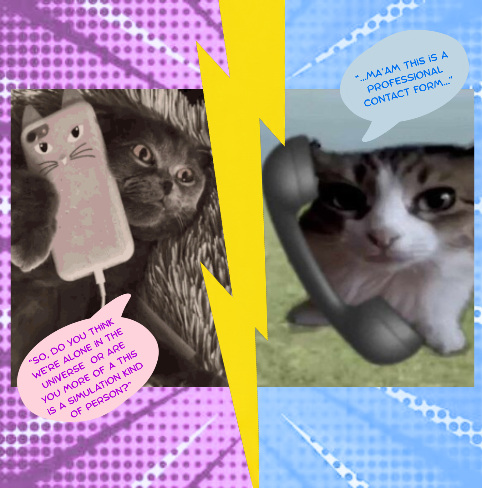

::: {layout-ncol=2 style="align-items: center; margin-top: 50px; margin-bottom: 50px;"}

::: {#image-col}
<div style="text-align: center;">
  
</div>
:::

::: {#form-col}
```{=html}
<div style="background: #ffffff; padding: 40px; border-radius: 15px; box-shadow: 0 10px 30px rgba(0,0,0,0.08); border: 1px solid #f0f0f0;">
  <div class="mb-4">
    <label for="toEmail" class="form-label" style="font-weight: 600; font-size: 1.1rem; color: #333;">To</label>
    <div class="input-group" title="Want to copy Veronica's email address?">
      <input type="text" class="form-control" id="toEmail" value="vmpletsch@gmail.com" readonly style="background-color: #f8f9fa; font-size: 1.05rem;">
      <button class="btn btn-outline-secondary" type="button" onclick="navigator.clipboard.writeText('vmpletsch@gmail.com'); alert('Email address copied!');">
        <i class="bi bi-clipboard"></i> Copy
      </button>
    </div>
  </div>
  <div class="mb-4">
    <label for="customMessage" class="form-label" style="font-weight: 600; font-size: 1.1rem; color: #333;">Message</label>
    <textarea class="form-control" id="customMessage" rows="8" placeholder="Write your message here..." style="font-size: 1.05rem;" oninput="document.getElementById('sendEmailBtn').href = 'https://mail.google.com/mail/?view=cm&fs=1&to=vmpletsch@gmail.com&su=Message from Website&body=' + encodeURIComponent(this.value);"></textarea>
  </div>
  <div class="text-center" style="margin-top: 30px;">
    <a id="sendEmailBtn" href="https://mail.google.com/mail/?view=cm&fs=1&to=vmpletsch@gmail.com&su=Message from Website" target="_blank" class="btn btn-primary" style="background-color: #fa70ff; border-color: #fa70ff; width: 100%; font-weight: bold; font-size: 1.1rem; border-radius: 8px; padding: 12px;">
      Send via Gmail
    </a>
  </div>
</div>
```
:::

:::
