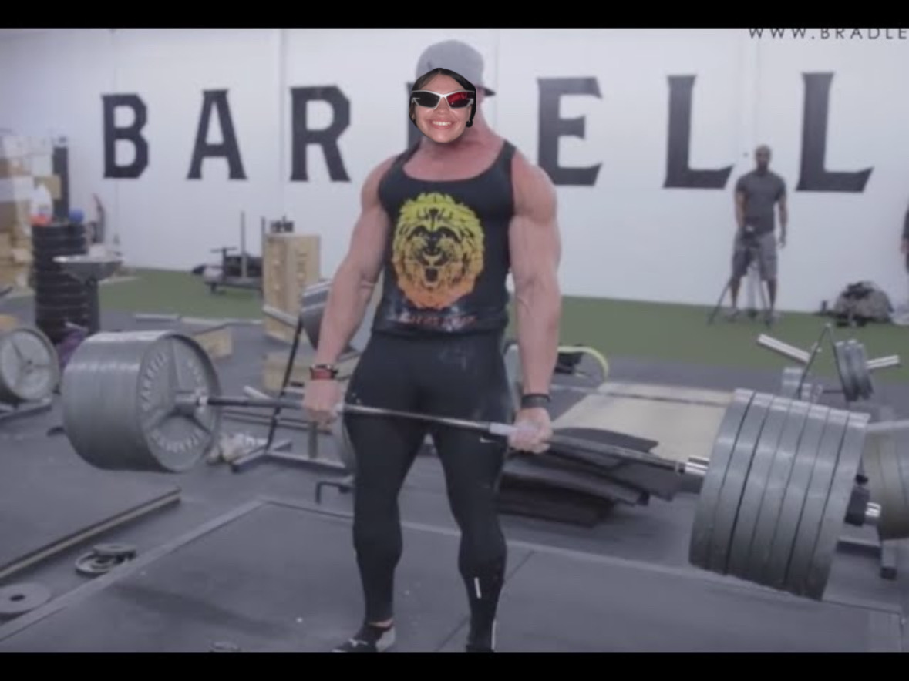

::: {style="min-height: 100vh; display: flex; flex-direction: column; justify-content: center; align-items: center; padding: 20px; max-width: 800px; margin: 0 auto; width: 100%;"}

<h1 class="tracking-in-expand" style="font-size: 100px; margin-bottom: -30px; line-height: 1; font-family: 'DM Serif Display', serif; text-align: center; width: 100%;">Veronica Pletsch</h1>

{.about-img width="30%" fig-align="center"}

<h2 style="text-align: center; width: 100%; margin-bottom: 15px;">Welcome to my portfolio</h2>

Data scientist | Social Science Researcher

  <a href="#testimonials" class="scroll-down-arrow">
    <i class="bi bi-chevron-down" style="font-size: 3rem; color: #881ca3;"></i>
  </a>

:::

::: {#testimonials class="testimonial-container"}
## Testimonials

"Not only is she a talented quantitative and qualitative social researcher, but she never skips the opportunity to help an old lady cross the street."

— my mom, a pretty cool lady

"A terrific research associate, always eager to grow and be challenged. (What I imagine was said in the letter of recommendation wrote for my UChicago application... alas I waived my right to read it. But hey, I got accepted so it had to be good.) "

—  former manager, NORC

"That kid's got gumption, no social or financial barrier has ever stopped her, but boy did they try."

— Veronica Pletsch (me), Researcher

  <a href="#about" class="scroll-down-arrow">
    <i class="bi bi-chevron-down" style="font-size: 3rem; color: #881ca3;"></i>
  </a>

:::

::: {#about style="padding: 100px 20px; text-align: left; max-width: 800px; margin: 0 auto; min-height: 60vh;"}
## About Me

Hey there! I'm Veronica, when I'm not giving myself musculoskeletal issues and heart palpitations from being hunched over my computer doing research with 400 milligrams of caffeine in my system, I like to dabble in my hobbies. I love playing with my cat Sabrina who is the size of exactly half a rice cooker and hit the gym as an amateur body builder who can totally deadlift 675lbs.

Thanks for stopping by! While you're here, please explore my recent research projects, writing samples, and while you're at it, take a PDF copy of my resume as a souvenir of your trip here.

::: {layout-ncol=2 style="margin-top: 40px; center;"}
{.about-img}

{.about-img}
:::
:::