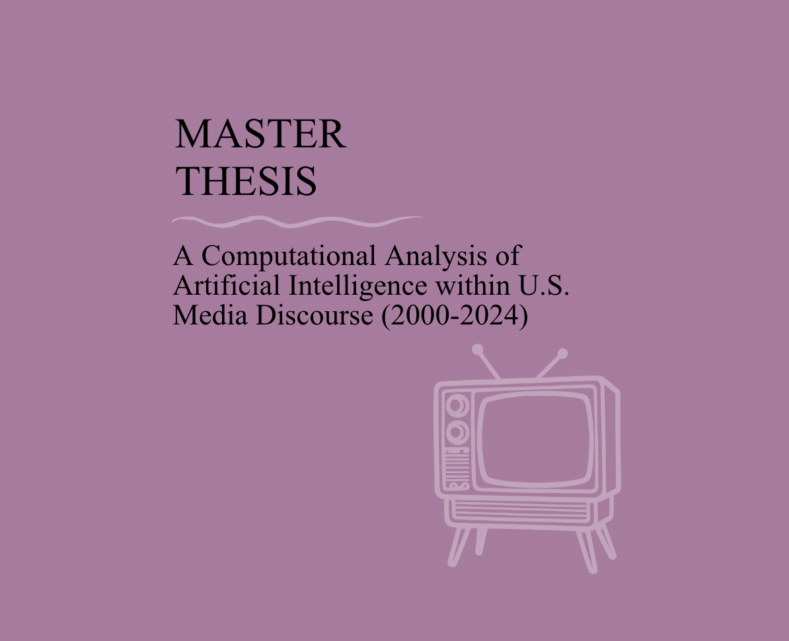
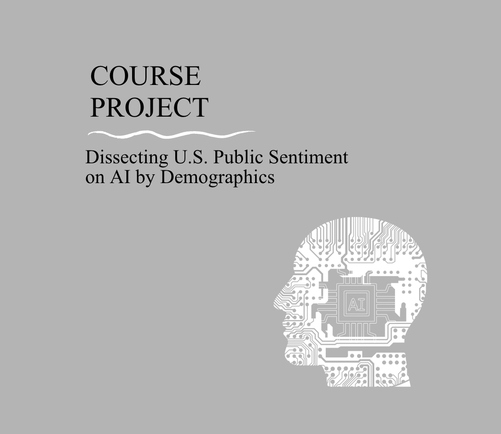
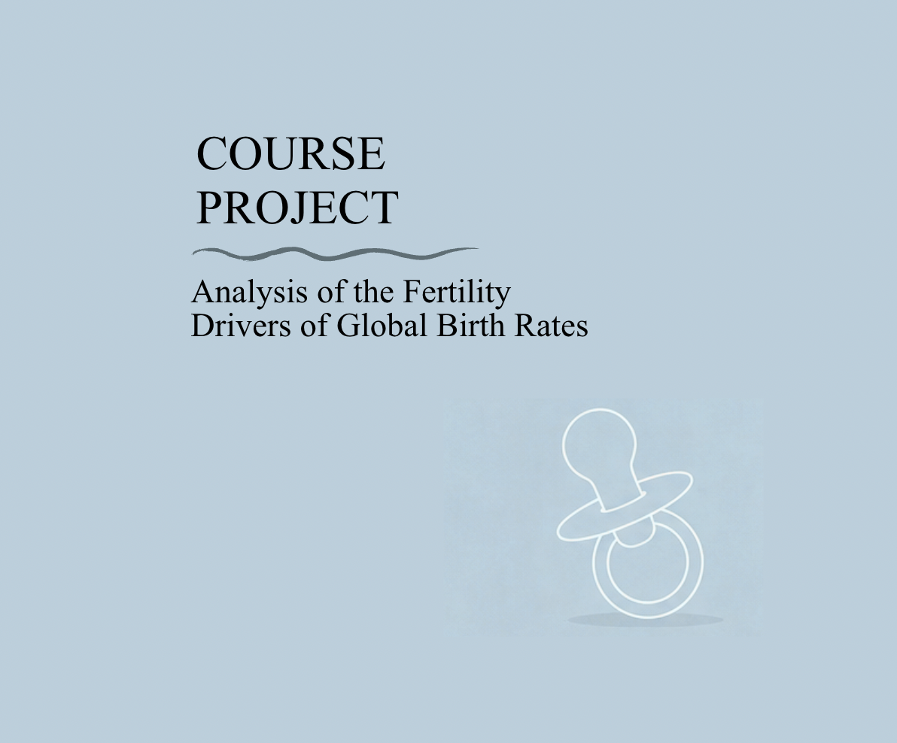
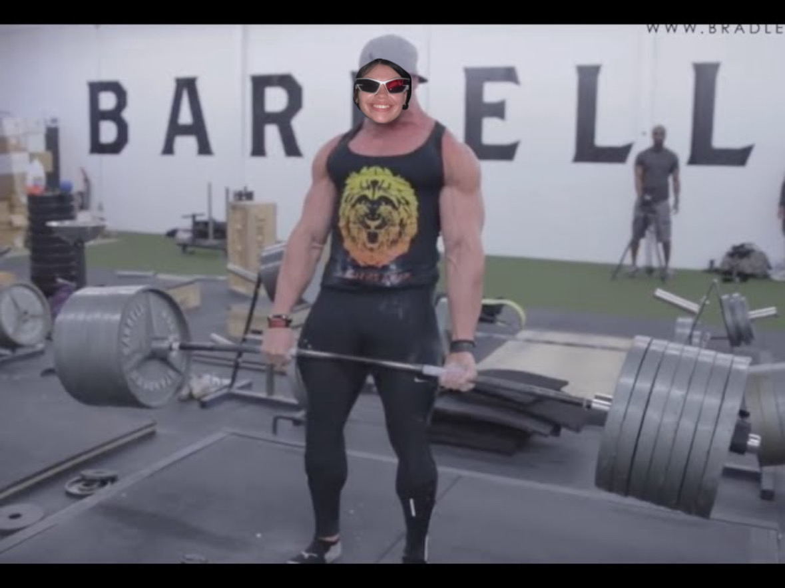

<style>
  #title-block-header { display: none !important; }
</style>
<link rel="stylesheet" href="custom.css?v=20260825-6">

::: {style="min-height: 100vh; display: flex; flex-direction: column; justify-content: center; align-items: center; padding: 20px; max-width: 800px; margin: 0 auto; width: 100%;"}

<h1 class="tracking-in-expand" style="font-size: 100px; margin-bottom: 0px; line-height: 1; font-family: 'DM Serif Display', serif; text-align: center; width: 100%;">Veronica Pletsch</h1>

<div style="text-align: center; margin-top: 0px; margin-bottom: 50px;">
  
</div>

<h2 style="text-align: center; width: 100%; margin-bottom: 10px; margin-top: 0px;">Welcome to my portfolio</h2>

<p style="text-align: center; width: 100%; font-size: 1.2rem;">Data Scientist | Social Science Researcher</p>

<div style="margin-top: 0px; margin-bottom: 200px">
  <a href="#latest-work" class="scroll-down-arrow" aria-label="Jump to latest work">
    <i class="bi bi-chevron-down" style="font-size: 3rem; color: #881ca3;"></i>
  </a>
</div>
:::

::: {#latest-work class="latest-work-container"}
## See My Latest Work

<p class="latest-work-intro">A selection of recent research and interactive data projects spanning natural language processing, public-interest research, and data visualization.</p>

```{=html}
<div class="latest-work-grid">
  <a class="latest-work-card" href="Projects/projects/AINews.html">
    
    <span class="latest-work-label">Featured thesis project</span>
    <h3>AI Within News Media Discourse</h3>
    <p>Interactive R Shiny dashboard examining how U.S. news media framed artificial intelligence from 2000–2024.</p>
    <span class="latest-work-link">Explore the dashboard <i class="bi bi-arrow-right latest-work-arrow" aria-hidden="true"></i></span>
  </a>
  <a class="latest-work-card" href="Projects/projects/AISentiment.html">
    
    <span class="latest-work-label">Interactive analysis</span>
    <h3>AI Sentiment by Demographics</h3>
    <p>R Shiny dashboard analyzing public sentiment toward AI across demographic intersections using Pew Research Center survey data.</p>
    <span class="latest-work-link">View the project <i class="bi bi-arrow-right latest-work-arrow" aria-hidden="true"></i></span>
  </a>
  <a class="latest-work-card" href="Projects/projects/FertilityDrivers.html">
    
    <span class="latest-work-label">Data visualization</span>
    <h3>Fertility Drivers</h3>
    <p>Interactive analysis of global birth rates and the socioeconomic factors associated with fertility patterns.</p>
    <span class="latest-work-link">View the project <i class="bi bi-arrow-right latest-work-arrow" aria-hidden="true"></i></span>
  </a>
</div>
```

<div style="margin-top: 50px;">
  <a href="#about" class="scroll-down-arrow" aria-label="Jump to about me">
    <i class="bi bi-chevron-down" style="font-size: 3rem; color: #881ca3;"></i>
  </a>
</div>
:::

::: {#about style="padding: 20px 20px; text-align: left; max-width: 800px; margin: 0 auto; min-height: 60vh;"}
## About Me

Hey there! Before we get to the nerdy, fun stuff, here's some serious context. I am a first generation high school and college graduate, I was raised in poverty by a single teenage mom in Chicago. These details matter, they've shaped who I am both personally and professionally. It was poverty that influenced me to think critically and analytically in order to overcome the psychological, financial, and social barriers placed on me. It is from these experiences that I first became curious by the perplexing nature of human behavior, society, and social interactions. Ultimately, through my career as a social science researcher and data scientist, I strive to *"discover the hidden logic of familiar things"* to better understand our complex social world and to hopefully leave it better than I found it.

On a lighter note, when I'm not giving myself musculoskeletal issues and heart palpitations from being hunched over my computer doing research with 400 milligrams of caffeine in my system, I like to dabble in my hobbies. I love playing with my cat Sabrina, who likes to loaf in her rice cooker box and offer side quests to passers-by. I also love to hit the gym as an amateur bodybuilder and yes... I can totally deadlift 675 lbs. And of course, I love to travel!

Anyway, while you're here, please explore my recent research projects, writing samples, and while you're at it, take a PDF copy of my resume as a souvenir of your trip here.

Thanks for stopping by! 

```{=html}
<div class="about-photo-row">
  <figure>
    
    <figcaption>Lil Mama Sabrina</figcaption>
  </figure>
  <figure>
    
    <figcaption>Definitely me deadlifting</figcaption>
  </figure>
  <figure>
    
    <figcaption>Ms. Worldwide</figcaption>
  </figure>
</div>
```
:::
