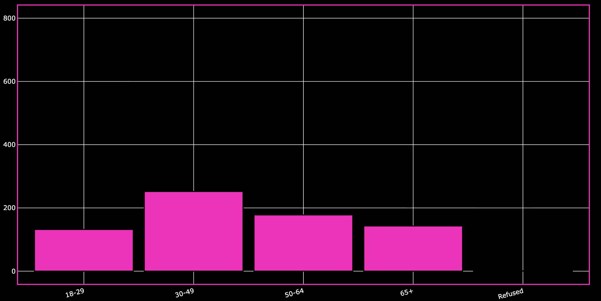
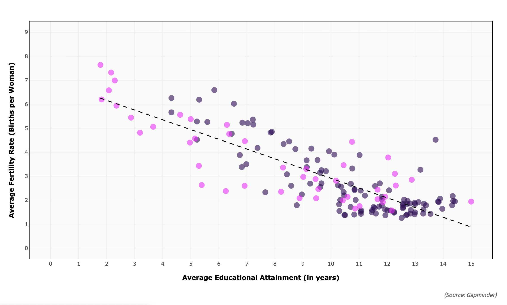

<style>
  #title-block-header { display: none !important; }
</style>

```{=html}
<div class="ux-page">

<section class="ux-hero" aria-labelledby="ux-page-title">
  <p class="ux-eyebrow">SELECTED WORK</p>
  <h1 id="ux-page-title">UX &amp; Product Design</h1>
  <p class="ux-lede">I design research-driven digital experiences that make complex information feel approachable, interactive, and visually memorable.</p>
  <nav class="ux-jump-nav" aria-label="Explore UX portfolio sections">
    <a href="#data-products">Data products</a>
    <a href="#web-products">Web experiences</a>
    <a href="#design-principles">Design approach</a>
  </nav>
</section>

<section id="data-products" class="ux-section" aria-labelledby="data-products-title">
  <div class="ux-section-heading">
    <p class="ux-eyebrow">01 / INTERACTIVE STORYTELLING</p>
    <h2 id="data-products-title">Data products built for exploration</h2>
    <p>These projects translate research questions and multi-dimensional datasets into interfaces that invite people to explore, compare, and form their own understanding.</p>
  </div>

  <article class="ux-case-study ux-case-study-featured">
    <div class="ux-case-visual">
      
    </div>
    <div class="ux-case-copy">
      <p class="ux-case-number">CASE STUDY 01</p>
      <h3>AI Within News Media Discourse</h3>
      <p class="ux-problem"><strong>Design challenge:</strong> Make a computational media-analysis thesis navigable for people who do not arrive with a statistical or coding background.</p>
      <ul class="ux-decisions">
        <li><strong>Visual system:</strong> A retro-computing palette and television-inspired motion establish AI and media as the subject before a user reads a chart.</li>
        <li><strong>Guided exploration:</strong> Clear tabs, filters, and concise context let visitors move from the overview to demographic and political comparisons at their own pace.</li>
        <li><strong>Readable analysis:</strong> High-contrast labels and white chart surfaces keep the visual storytelling expressive without compromising interpretation.</li>
      </ul>
      <div class="ux-tags" aria-label="Tools and methods"><span>R Shiny</span><span>Information architecture</span><span>Data visualization</span><span>Interaction design</span></div>
      <p class="ux-actions"><a href="Projects/projects/AINews.html">Explore the full project <i class="bi bi-arrow-right" aria-hidden="true"></i></a><a href="https://3vw3oh-veronica-pletsch.shinyapps.io/shiny/" target="_blank" rel="noopener">Open live app <i class="bi bi-box-arrow-up-right" aria-hidden="true"></i></a></p>
    </div>
  </article>

  <div class="ux-case-grid">
    <article class="ux-case-study ux-case-study-compact">
      <div class="ux-case-visual"></div>
      <div class="ux-case-copy">
        <p class="ux-case-number">CASE STUDY 02</p>
        <h3>AI Sentiment by Demographics</h3>
        <p>Interactive demographic comparisons turn survey data into a clear, user-directed story about public sentiment toward AI.</p>
        <div class="ux-tags"><span>R Shiny</span><span>Survey data</span><span>Visual hierarchy</span></div>
        <a class="ux-text-link" href="Projects/projects/AISentiment.html">View project <i class="bi bi-arrow-right" aria-hidden="true"></i></a>
      </div>
    </article>

    <article class="ux-case-study ux-case-study-compact">
      <div class="ux-case-visual"></div>
      <div class="ux-case-copy">
        <p class="ux-case-number">CASE STUDY 03</p>
        <h3>Fertility Drivers</h3>
        <p>A visual analysis that helps users connect global birth-rate patterns with the social and economic factors behind them.</p>
        <div class="ux-tags"><span>R Shiny</span><span>Interactive analysis</span><span>Data storytelling</span></div>
        <a class="ux-text-link" href="Projects/projects/FertilityDrivers.html">View project <i class="bi bi-arrow-right" aria-hidden="true"></i></a>
      </div>
    </article>
  </div>
</section>

<section id="web-products" class="ux-section ux-section-tint" aria-labelledby="web-products-title">
  <div class="ux-section-heading">
    <p class="ux-eyebrow">02 / WEB &amp; DIGITAL PRODUCTS</p>
    <h2 id="web-products-title">Designing for a fast first impression</h2>
  </div>
  <article class="ux-case-study ux-web-case">
    <div class="ux-web-art" aria-hidden="true">
      <span class="ux-browser-dot"></span><span class="ux-browser-dot"></span><span class="ux-browser-dot"></span>
      <div class="ux-browser-content">
        <p>VERONICA PLETSCH</p>
        <div></div><div></div><div></div>
      </div>
    </div>
    <div class="ux-case-copy">
      <p class="ux-case-number">CASE STUDY 04</p>
      <h3>Professional Portfolio Experience</h3>
      <p class="ux-problem"><strong>Design challenge:</strong> Give recruiters a clear path from first impression to relevant work, downloadable materials, and contact information.</p>
      <ul class="ux-decisions">
        <li><strong>Scannable structure:</strong> A visual “Latest Work” section surfaces the strongest projects before deeper browsing begins.</li>
        <li><strong>Intentional paths:</strong> Navigation and direct project links support both a quick review and a deeper exploration of the work.</li>
        <li><strong>Accessible handoff:</strong> Résumé, CV, contact links, and responsive layouts reduce friction when a visitor is ready to connect.</li>
      </ul>
      <div class="ux-tags"><span>Quarto</span><span>HTML/CSS</span><span>UX writing</span><span>Responsive design</span></div>
      <p class="ux-actions"><a href="index.html">Visit the portfolio <i class="bi bi-arrow-right" aria-hidden="true"></i></a></p>
    </div>
  </article>
</section>

<section id="design-principles" class="ux-section ux-principles" aria-labelledby="design-principles-title">
  <div class="ux-section-heading">
    <p class="ux-eyebrow">03 / DESIGN APPROACH</p>
    <h2 id="design-principles-title">How I approach digital experiences</h2>
  </div>
  <div class="ux-principles-grid">
    <article><span>01</span><h3>Make complexity legible</h3><p>Organize information so people can understand the landscape before they are asked to interpret details.</p></article>
    <article><span>02</span><h3>Give people agency</h3><p>Use filters, comparisons, and progressive disclosure to let users choose their own path through an experience.</p></article>
    <article><span>03</span><h3>Let the visual language carry meaning</h3><p>Build color, motion, imagery, and hierarchy around the subject matter—not as decoration added afterward.</p></article>
  </div>
</section>

<section class="ux-next" aria-label="More work coming soon">
  <p class="ux-eyebrow">NEXT UP</p>
  <h2>Marketing, social, and visual-design work is being curated for this collection.</h2>
  <p>For now, explore the interactive projects above or get in touch to discuss design and product opportunities.</p>
  <a href="contact.html">Let’s connect <i class="bi bi-arrow-right" aria-hidden="true"></i></a>
</section>

</div>
```
